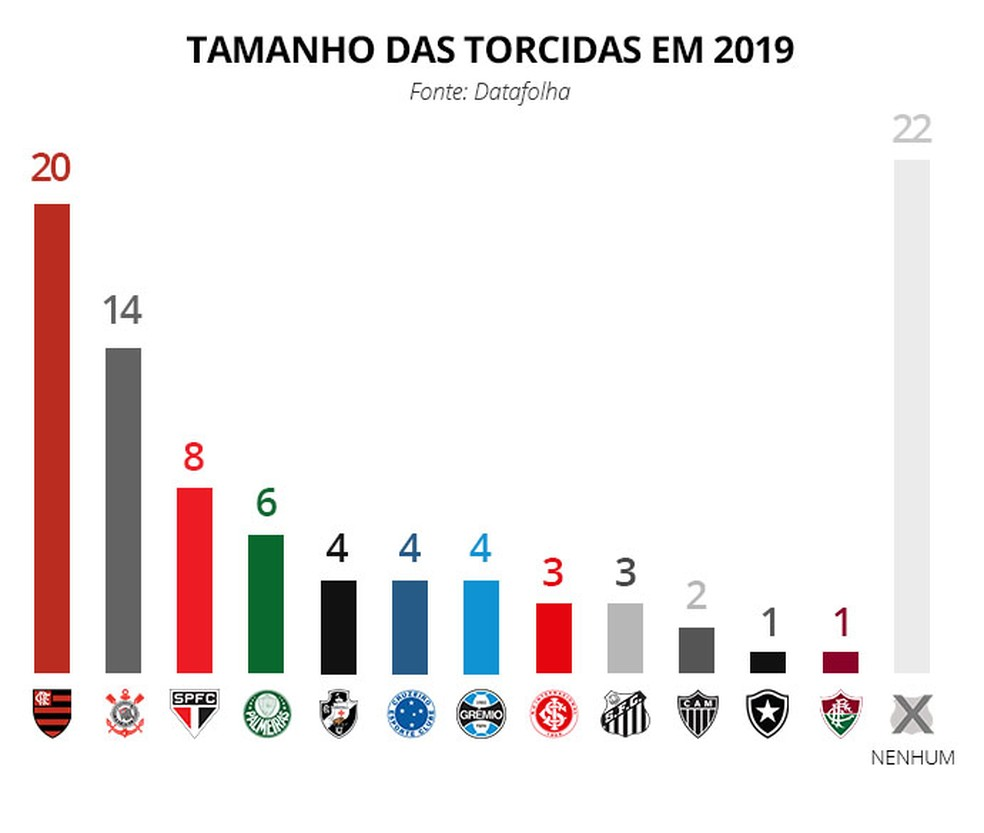
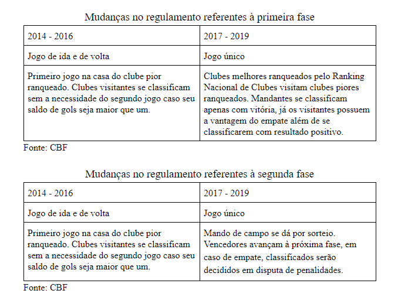

```{r setup, include=FALSE}
library(flexdashboard)
library(knitr)
library(formattable)
library(sparkline)
library(dygraphs)
library(dplyr)
library(tidyverse)
library(forcats)
library(ggplot2)
library(knitr)
library(kableExtra)
```

Home 
=====================================
> Introdução

> O Brasil é conhecido internacionalmente como país do futebol. E isso se dá por diversos fatores, como: Popularidade do esporte, conquistas esportivas da seleção nacional no contexto global etc. Com isso, o futebol brasileiro tem suas nuances amplamente discutidas, seja por torcedores ou analistas esportivos. Alguns destes pontos de discussões e crenças estão amplamente enraizado no imaginário popular brasileiro. Quem nunca ouviu "Quem não faz leva"? Ou ainda, "Virou um Fla-Flu"?

> Observando as complexidades e nuances do futebol brasileiro representada em palavras anteriormente, surge em muitos a vontade de uma opinião mais qualitativa para certas questões do futebol. E, por isso, há uma motivação de um estudo mais aprofundando sobre as questões do futebol brasileiro, principalmente através de análises estatísticas. Para a melhor investigação deveremos nos ater a perguntas bem específicas e bem formuladas. Sabendo o caminho que queremos chegar, certamente teremos sucesso e assim alcançaremos as respostas matematicamente embasadas . 

> Este trabalho se propõe a duas questões básicas, são elas: Intervenção do público no campeonato de pontos corridos e influência do regulamento no campeonato de sistema eliminatório, também conhecido como mata-mata. Sempre existiu a percepção que a torcida move o time em campo, isso além do senso-comum foi escrito por cronistas nos mais variados lugares. Para Carlos Alberto Vieira, editor do LANCE!, “Dizer que a torcida do Flamengo carrega o time é chover no molhado. O que vimos nas três vitórias seguidas em casa foi prova do que acontece há décadas e sempre faz a diferença para o Rubro-Negro. Como o time vem conseguindo os resultados a tendência é que este apoio aumente ainda mais. Tivemos 40 mil contra o Atlético? Vá contabilizando 50 mil, 60 mil nas próximas rodadas pois o torcedor ganha gosto de saber que ele é realmente o 12º jogador”.

> O sistema eliminatório é muito querido pelos brasileiros por diversos fatores, o principal deles é certamente a emoção gerada por partidas eliminatórias. O principal embate regulamentar é a discussão sobre os critérios desempates, principalmente o chamado “gol fora”. Joseph Blatter, o então presidente da FIFA, teceu críticas a este critério. Disse ele, "Na verdade, a regra do gol fora de casa favorece a equipe que joga fora no jogo de volta. Com o placar empatado, o time tem 30 minutos a mais que seu oponente para fazer o gol fora. Além disso, na primeira partida não há possibilidade de tempo extra. É hora de repensar esse sistema. O futebol progrediu desde os anos 60 e a regra do gol fora de casa pode não ser questionada. Mas esta regra faz algum sentido?"

> Metodologia

> Apresentado os temas e propostas, faz-se necessário a organização do processo estatístico para obtenção das respostas. A primeiro etapa é a obtenção e limpeza de dados. A coleta de dados fora feita parte manualmente (Através de pesquisas na web e obtenção em fontes primárias como a CBF), parte computacionalmente (Através da extensão do Chrome Data Mining); e ainda um dataset disponível no Kaggle com os resultados do Campeonato Brasileiro desde 2003. Para limpeza de dados utilizou-se através da linguagem R e o software Microsoft Excel. Para as análises foi-se necessário medidas estatísticas e a visualização dos dados obtidos. A publicação e formatação visual das apresentações utilizou-se do R markdown, R notebook e flexdashboard.

> Autores: Pedro Henrique Ribeiro Alves e Rodolfo Bramont Eiriz de Souza | Orientação: Professor Cássio Almeida

> Metodologia e Introdução

Campeonato Brasileiro {data-navmenu="Competições Nacionais"}
=====================================

Row {.tabset .tabset-fade}
-------------------------------------

### Tabela de Dados Geral

> O primeiro dilema advindo da relação entre presença dos torcedores no estádio e desempenho esportivo dos times é o "dilema do ovo e da galinha". Ou seja, os times vão bem porque seus torcedores estão presentes ou torcedores estão presentes porque seus times estão indo bem? Inicialmente precisamos analisar a diferença esportiva entre mandantes e visitantes, ainda que exista um ruído matemático, pois são inúmeras as variáveis responsáveis pelo desempenho de um time de futebol.
    
```{r}
#Datasets for brazilian soccer analysis

#league_br is a dataset for results of Campeonato Brasileiro since 2003 
league_br = read.csv('F:\\Arquivos\\R\\futebol_brasileiro\\Arquivos\\campeonato_brasil\\campeonato-brasileiro-full.csv', sep = ",")
#audience_br is a dataset for audience of Campeonato Brasileiro since 2013
audience_br = read.csv('F:\\Arquivos\\R\\futebol_brasileiro\\Arquivos\\campeonato_brasil\\publico_brasileirao.csv', sep = ";")
#public_mean_br is a dataset for annual audience average of Campeonato Brasileiro since 2003
public_mean_br = read.csv('F:\\Arquivos\\R\\futebol_brasileiro\\Arquivos\\campeonato_brasil\\Media_Publico_Anual_Clube_03_19.csv', sep = ";", header = TRUE)

#public_mean_br dataset refinements
public_mean_br = public_mean_br[,1:18]
colnames(public_mean_br) = c("Time","2003","2004","2005","2006","2007","2008","2009","2010","2011","2012","2013","2014","2015","2016","2017","2018","2019")

#Visualization of public_mean_br
formattable(public_mean_br, align = c("l", rep("r", NCOL(public_mean_br) - 1)), list(
    `Time` = formatter("span", style = ~ style(color = "grey",font.weight = "bold")), 
     area(col = 2:18) ~ color_tile("#DeF7E9", "#71CA97")))
```

### Série Temporal [Campeões]

> Uma análise da série temporal abaixo demonstra todo tipo de time de campeão, time com pouca média de público, caso do Fluminense em 2012 com 12644, time com alta média de público, caso do Flamengo em 2019 com 55025. Isso demonstra que o maior fator de decisão do futebol ainda está dentro de campo, o time com melhor técnica e melhor disposição tática dentro do campo irá sobressair-se, principalmente em campeonato por pontos corridos, onde a regularidade é o fator mais importante para a conquista do campeonato.


```{r}
#Annual audience average of brazilians champions

brazilian_champions = c("Cruzeiro","Santos","Corinthians","São Paulo","São Paulo","São Paulo","Flamengo","Fluminense","Corinthians","Fluminense","Cruzeiro","Cruzeiro","Corinthians","Palmeiras","Corinthians","Palmeiras","Flamengo")

annual_audience_average_champions = 1:length(brazilian_champions)
for (i in 1:length(brazilian_champions)) {
  annual_audience_average_champions[i] = public_mean_br[public_mean_br$Time == brazilian_champions[i],i+1]
}

annual_audience_average_champions = data.frame(2003:2019,annual_audience_average_champions)
colnames(annual_audience_average_champions) = c("Ano","Média de Público")

dygraph(annual_audience_average_champions, main =  "Média de Público dos Campeões Brasileiros") %>%
dyOptions(labelsUTC = TRUE, fillGraph=TRUE, fillAlpha=0.1, drawGrid = FALSE, colors="#D8AE5A")
```

### Boxplot [Times]

```{r}
#public_mean_br_continuous is a dataset for annual audience average of Campeonato Brasileiro since 2003
public_mean_br_continuous = read.csv('F:\\Arquivos\\R\\futebol_brasileiro\\Arquivos\\campeonato_brasil\\publicmean.csv', sep = ";", header = TRUE)

#Boxplot of public_mean_br_transposed
ggplot(public_mean_br_continuous, aes(x=Times, y=Público)) + 
    geom_boxplot()+
    coord_flip()+
    ggtitle("Boxplot - Times e seus públicos")
```

### Histograma [Comentário]

> A análise dos histogramas, o que está abaixo e o que está na próxima chart, mostra-nos que há uma diferença favorável aos mandantes ainda que tenhamos um relativo equilíbrio no caso dos gols. Então o fator casa, presença majoritária de público, é necessariamente benéfica ao clube mandante. Isto mostra que a torcida faz diferença, mas não necessariamente que a quantidade de torcedores presente nos estádios afetaria o desempenho positivamente. 

> Comentário

### Histograma [Mandante]

```{r}
ggplot(league_br, aes(x=Clube.1.Gols)) +
    geom_histogram(fill="#69b3a2", color="#e9ecef", alpha=0.9) +
    ggtitle("Gols Mandante - Histograma")+
    xlab("Gols Mandante")
```

### Histograma [Visitante]

```{r}
ggplot(league_br, aes(x=Clube.2.Gols)) +
    geom_histogram(fill="#69b3a2", color="#e9ecef", alpha=0.9) +
    ggtitle("Gols Visitante - Histograma")+
    xlab("Gols Visitante")
```

### Tabela [Visitante x Mandante]

> A tabela abaixo mostra através de medidas estatísticas o que fora representado pelos gráficos de histogramas anteriores. Mas agora, além da medida de centralidade que representa significativamente nossos dados na questão de superioridade dos mandantes para com os visitantes. Temos um número de mais de o dobro de vitória por partes dos mandantes, que volta a corroborar sobre a importância de jogar perante sua torcida.

```{r}
Media_Gols_Mandante = mean(as.numeric(league_br$Clube.1.Gols))
Media_Gols_Visitante = mean(as.numeric(league_br$Clube.2.Gols))
Media_Gols_Mandante_Visitante = c(Media_Gols_Visitante,Media_Gols_Mandante)
Resultado_Mandante = ifelse(league_br$Clube.1 == league_br$Vencedor,3,ifelse(league_br$Vencedor == "-",1,0))
Tabulado_Resultado_Mandante = table(Resultado_Mandante)
Dados_Mandante_Visitante = data.frame(cbind(Media_Gols_Mandante_Visitante,Tabulado_Resultado_Mandante[c(1,3)]))
rownames(Dados_Mandante_Visitante) = c("Visitante","Mandante")
colnames(Dados_Mandante_Visitante) = c("Media_Gols","Vitorias")

Dados_Mandante_Visitante %>% kable() %>% kable_styling()
```

### Tabela [Evento Aleatório do Vetor - Ano 2013]

```{r}
brasileirao = read.csv2("F:\\Arquivos\\R\\futebol_brasileiro\\Arquivos\\campeonato_brasil\\brasileiro_dados.csv", fileEncoding = "UTF-8")

brasileirao = filter(brasileirao, tempo_gol != "None") # EXCLUINDO TODOS OS RESULTADOS QUE TERMINARAM 0X0

brasileirao$tempo_gol = as.integer(brasileirao$tempo_gol)
jogos_resultados = brasileirao %>% group_by(id_jogo) %>% filter(tempo_gol == max(tempo_gol)) # SELECIONA O INSTANTE QUE ACONTECE O ULTIMO GOL EM CADA PARTIDA

ic_placar_time_casa = t.test(jogos_resultados$placar_time_a, alternative = "two.sided", conf.int=TRUE) # IC PARA PLACAR MANDANTE
ic_placar_time_visitante <- t.test(jogos_resultados$placar_time_b, alternative = "two.sided", conf.int=TRUE) # IC PARA PLACAR VISITANTE

ic_casa = data.frame(Clube="Mandante",lower=ic_placar_time_casa$conf.int[1], Media = mean(jogos_resultados$placar_time_a, na.rm=TRUE) ,upper=ic_placar_time_casa$conf.int[2]) # IC MANDANTE
ic_visitante = data.frame(Clube="Visitante",lower=ic_placar_time_visitante$conf.int[1], Media = mean(jogos_resultados$placar_time_b, na.rm=TRUE) ,upper=ic_placar_time_visitante$conf.int[2]) # IC VISITANTE

toPlot2 = rbind(ic_casa, ic_visitante) # UNINDO OS ICs

ggplot(data=toPlot2, aes(x=Clube, y=Media, colour=Clube)) + geom_point() +
   geom_errorbar(aes(ymin=lower, ymax=upper), width=.1) + theme_bw()
```

### Tabelas de Dados Gerais do Brasileirão [Visitante]

```{r}
Media_Publico = mean(public_mean_br_continuous$Público)
Media_Gols = mean(league_br$Clube.1.Gols + league_br$Clube.2.Gols)
Total_Publico = sum(public_mean_br_continuous$Público)
Total_Gols = sum(league_br$Clube.1.Gols + league_br$Clube.2.Gols)
Dados_Gerais_Brasileiro = cbind(Media_Publico,Media_Gols,Total_Publico,Total_Gols)
colnames(Dados_Gerais_Brasileiro) = c("Média de Público","Média de Gols","Público Total","Gols Totais")
rownames(Dados_Gerais_Brasileiro) = c("Dados do Brasileirão")


Dados_Gerais_Brasileiro %>% kable() %>% kable_styling()
```

Análise por Clube [C. Brasileiro] {.storyboard} 
=========================================
```{r, include= FALSE}
league_br2 = league_br[5280:7939,]
league_br_with_audience = cbind(league_br2,audience_br)
```

### Campeonato Brasileiro [Análise]

> Análise 

> Como parte da solução do dilema do ovo e da galinha aplicado aos times de futebol e seus torcedores, decidimos entender a dispersão entre resultados e público presente nos jogos. Utilizamos dois gráficos para isso, onde uma mostra a relação entre pontuação realizada na partida e público presente no estádio, e outro, a relação entre gols e público presente no estádio.

> Enquanto os gráficos anteriormente citados buscam compreender a relação direta entre público e desempenho. O gráfico agora proposto busca entender a influência dos resultados no público dos próximos jogos. Com isso, fizemos uma taxa de apelo por jogo para cada público. A taxa é calculada pela soma entre o quociente dos gols mais pontos obtidos nos últimos três jogos divididos pelas respectivas médias aritméticas. Por exemplo, o jogo de hoje seria teria uma taxa de apelo calculada a partir dos três jogos anteriores.

> 

> O gráfico acima representa as maiores torcidas do campeonato brasileiro. E Isso é especialmente correlato com os resultados obtidos a partir das taxas de apelo e o público presente. Três entre os quatros maiores clubes do Brasil em torcida tem uma pequena correlação linear na questão de público e torcida. O que nos leva a crer que esses times crescem principalmente pela sua capacidade de expansão em questão de torcida e presença de torcida.

> Diante dos gráficos, medidas e microdados, não resta dúvida que a torcida é especialmente importante. Ela influencia o jogo, mas está longe de ser o principal fator. Times mais técnicos independentemente de torcidas serão superiores aos seus rivais. E o regulamento equilibrado de um campeonato de pontos corridos que equaliza a quantidade de jogos fora e casa, e ainda, a extensão do calendário que prioriza a regularidade, mostra-nos que apesar da influência da torcida, o fator decisivo é o próprio futebol praticado pelos times.

> Análise 


###  Botafogo 

```{r}
#Creating Botafogo DF
Botafogo = league_br_with_audience %>% select(Clube.1, Clube.2, Vencedor, Publico, Clube.1.Gols) %>% filter(league_br_with_audience$Mandante == "Botafogo-RJ" | league_br_with_audience$Mandante == "Botafogo-rj")

Botafogo$Pontos = ifelse(Botafogo$Vencedor == Botafogo$Clube.1,3,ifelse(Botafogo$Vencedor == "-",1,0))

#Graphics of Botafogo DF
plot(Botafogo$Publico,Botafogo$Clube.1.Gols, main = "Relação Público x Gol", ylab = "Gols", xlab = "Público", type = "p", col = "gray", pch = "¤", cex = 2)
plot(Botafogo$Publico,Botafogo$Pontos, main = "Relação Público x Pontos", ylab = "Pontos", xlab = "Público", type = "p", col = "gray", pch = "¤", cex = 2)

#Botafogo Appeal

BotafogoAverage = (as.numeric(Botafogo$Clube.1.Gols) + as.numeric(Botafogo$Pontos))/(mean(as.numeric(Botafogo$Clube.1.Gols)) + mean(as.numeric(Botafogo$Pontos)))
BotafogoAverage_1 = c(0,BotafogoAverage[-length(BotafogoAverage)])
BotafogoAverage_2 = c(0,0,BotafogoAverage[-length(BotafogoAverage)])
BotafogoAverage_2 = BotafogoAverage_2[-length(BotafogoAverage_2)]
BotafogoAverage_3 = c(0,0,0,BotafogoAverage[-length(BotafogoAverage)])
BotafogoAverage_3 = BotafogoAverage_3[-length(BotafogoAverage_3)]
BotafogoAverage_3 = BotafogoAverage_3[-length(BotafogoAverage_3)]
BotafogoAverage = BotafogoAverage_1 + BotafogoAverage_2 + BotafogoAverage_3

plot(Botafogo$Publico,BotafogoAverage, main = "Relação Apelo do Jogo x Público", ylab = "Taxa de Apelo Relativo", xlab = "Público", type = "p", col = "gray", pch = "¤", cex = 2)
```   

###  Flamengo 
    
```{r}
#Creating Flamengo DF
Flamengo = league_br_with_audience %>% select(Clube.1, Clube.2, Vencedor, Publico, Clube.1.Gols) %>% filter(league_br_with_audience$Mandante == "Flamengo")

Flamengo$Pontos = ifelse(Flamengo$Vencedor == Flamengo$Clube.1,3,ifelse(Flamengo$Vencedor == "-",1,0))

#Graphics of Flamengo DF
plot(Flamengo$Publico,Flamengo$Clube.1.Gols, main = "Relação Público x Gol", ylab = "Gols", xlab = "Público", type = "p", col = "gray", pch = "¤", cex = 2)
plot(Flamengo$Publico,Flamengo$Pontos, main = "Relação Público x Pontos", ylab = "Pontos", xlab = "Público", type = "p", col = "gray", pch = "¤", cex = 2)

#Flamengo Appeal

FlamengoAverage = (as.numeric(Flamengo$Clube.1.Gols) + as.numeric(Flamengo$Pontos))/(mean(as.numeric(Flamengo$Clube.1.Gols)) + mean(as.numeric(Flamengo$Pontos)))
FlamengoAverage_1 = c(0,FlamengoAverage[-length(FlamengoAverage)])
FlamengoAverage_2 = c(0,0,FlamengoAverage[-length(FlamengoAverage)])
FlamengoAverage_2 = FlamengoAverage_2[-length(FlamengoAverage_2)]
FlamengoAverage_3 = c(0,0,0,FlamengoAverage[-length(FlamengoAverage)])
FlamengoAverage_3 = FlamengoAverage_3[-length(FlamengoAverage_3)]
FlamengoAverage_3 = FlamengoAverage_3[-length(FlamengoAverage_3)]
FlamengoAverage = FlamengoAverage_1 + FlamengoAverage_2 + FlamengoAverage_3

plot(Flamengo$Publico,FlamengoAverage, main = "Relação Apelo do Jogo x Público", ylab = "Taxa de Apelo Relativo", xlab = "Público", type = "p", col = "gray", pch = "¤", cex = 2)
```

###  Fluminense
    
```{r}
#Creating Fluminense DF
Fluminense = league_br_with_audience %>% select(Clube.1, Clube.2, Vencedor, Publico, Clube.1.Gols) %>% filter(league_br_with_audience$Mandante == "Fluminense")

Fluminense$Pontos = ifelse(Fluminense$Vencedor == Fluminense$Clube.1,3,ifelse(Fluminense$Vencedor == "-",1,0))

#Graphics of Flamengo DF
plot(Fluminense$Publico,Fluminense$Clube.1.Gols, main = "Relação Público x Gol", ylab = "Gols", xlab = "Público", type = "p", col = "gray", pch = "¤", cex = 2)
plot(Fluminense$Publico,Fluminense$Pontos, main = "Relação Público x Pontos", ylab = "Pontos", xlab = "Público", type = "p", col = "gray", pch = "¤", cex = 2)

#Fluminense Appeal

FluminenseAverage = (as.numeric(Fluminense$Clube.1.Gols) + as.numeric(Fluminense$Pontos))/(mean(as.numeric(Fluminense$Clube.1.Gols)) + mean(as.numeric(Fluminense$Pontos)))
FluminenseAverage_1 = c(0,FluminenseAverage[-length(FluminenseAverage)])
FluminenseAverage_2 = c(0,0,FluminenseAverage[-length(FluminenseAverage)])
FluminenseAverage_2 = FluminenseAverage_2[-length(FluminenseAverage_2)]
FluminenseAverage_3 = c(0,0,0,FluminenseAverage[-length(FluminenseAverage)])
FluminenseAverage_3 = FluminenseAverage_3[-length(FluminenseAverage_3)]
FluminenseAverage_3 = FluminenseAverage_3[-length(FluminenseAverage_3)]
FluminenseAverage = FluminenseAverage_1 + FluminenseAverage_2 + FluminenseAverage_3

plot(Fluminense$Publico,FluminenseAverage, main = "Relação Apelo do Jogo x Público", ylab = "Taxa de Apelo Relativo", xlab = "Público", type = "p", col = "gray", pch = "¤", cex = 2)
```

###  Vasco
    
```{r}
#Creating Vasco DF
Vasco = league_br_with_audience %>% select(Clube.1, Clube.2, Vencedor, Publico, Clube.1.Gols) %>% filter(league_br_with_audience$Mandante == "Vasco" | league_br_with_audience$Mandante == "VASCO")

Vasco$Pontos = ifelse(Vasco$Vencedor == Vasco$Clube.1,3,ifelse(Vasco$Vencedor == "-",1,0))

#Graphics of Vasco DF
plot(Vasco$Publico,Vasco$Clube.1.Gols, main = "Relação Público x Gol", ylab = "Gols", xlab = "Público", type = "p", col = "gray", pch = "¤", cex = 2)
plot(Vasco$Publico,Vasco$Pontos, main = "Relação Público x Pontos", ylab = "Pontos", xlab = "Público", type = "p", col = "gray", pch = "¤", cex = 2)

#Vasco Appeal

VascoAverage = (as.numeric(Vasco$Clube.1.Gols) + as.numeric(Vasco$Pontos))/(mean(as.numeric(Vasco$Clube.1.Gols)) + mean(as.numeric(Vasco$Pontos)))
VascoAverage_1 = c(0,VascoAverage[-length(VascoAverage)])
VascoAverage_2 = c(0,0,VascoAverage[-length(VascoAverage)])
VascoAverage_2 = VascoAverage_2[-length(VascoAverage_2)]
VascoAverage_3 = c(0,0,0,VascoAverage[-length(VascoAverage)])
VascoAverage_3 = VascoAverage_3[-length(VascoAverage_3)]
VascoAverage_3 = VascoAverage_3[-length(VascoAverage_3)]
VascoAverage = VascoAverage_1 + VascoAverage_2 + VascoAverage_3

plot(Vasco$Publico,VascoAverage, main = "Relação Apelo do Jogo x Público", ylab = "Taxa de Apelo Relativo", xlab = "Público", type = "p", col = "gray", pch = "¤", cex = 2)
```

###  Corinthians
    
```{r}
#Creating Corinthians DF
Corinthians = league_br_with_audience %>% select(Clube.1, Clube.2, Vencedor, Publico, Clube.1.Gols) %>% filter(league_br_with_audience$Mandante == "Corinthians")

Corinthians$Pontos = ifelse(Corinthians$Vencedor == Corinthians$Clube.1,3,ifelse(Vasco$Vencedor == "-",1,0))

#Graphics of Corinthians DF
plot(Corinthians$Publico,Corinthians$Clube.1.Gols, main = "Relação Público x Gol", ylab = "Gols", xlab = "Público", type = "p", col = "gray", pch = "¤", cex = 2)
plot(Corinthians$Publico,Corinthians$Pontos, main = "Relação Público x Pontos", ylab = "Pontos", xlab = "Público", type = "p", col = "gray", pch = "¤", cex = 2)

#Corinthians Appeal

CorinthiansAverage = (as.numeric(Corinthians$Clube.1.Gols) + as.numeric(Corinthians$Pontos))/(mean(as.numeric(Corinthians$Clube.1.Gols)) + mean(as.numeric(Corinthians$Pontos)))
CorinthiansAverage_1 = c(0,CorinthiansAverage[-length(CorinthiansAverage)])
CorinthiansAverage_2 = c(0,0,CorinthiansAverage[-length(CorinthiansAverage)])
CorinthiansAverage_2 = CorinthiansAverage_2[-length(CorinthiansAverage_2)]
CorinthiansAverage_3 = c(0,0,0,CorinthiansAverage[-length(CorinthiansAverage)])
CorinthiansAverage_3 = CorinthiansAverage_3[-length(CorinthiansAverage_3)]
CorinthiansAverage_3 = CorinthiansAverage_3[-length(CorinthiansAverage_3)]
CorinthiansAverage = CorinthiansAverage_1 + CorinthiansAverage_2 + CorinthiansAverage_3

plot(Corinthians$Publico,CorinthiansAverage, main = "Relação Apelo do Jogo x Público", ylab = "Taxa de Apelo Relativo", xlab = "Público", type = "p", col = "gray", pch = "¤", cex = 2)
```

###  Palmeiras
    
```{r}
#Creating Palmeiras DF
Palmeiras = league_br_with_audience %>% select(Clube.1, Clube.2, Vencedor, Publico, Clube.1.Gols) %>% filter(league_br_with_audience$Mandante == "Palmeiras")

Palmeiras$Pontos = ifelse(Palmeiras$Vencedor == Palmeiras$Clube.1,3,ifelse(Palmeiras$Vencedor == "-",1,0))

#Graphics of Palmeiras DF
plot(Palmeiras$Publico,Palmeiras$Clube.1.Gols, main = "Relação Público x Gol", ylab = "Gols", xlab = "Público", type = "p", col = "gray", pch = "¤", cex = 2)
plot(Palmeiras$Publico,Palmeiras$Pontos, main = "Relação Público x Pontos", ylab = "Pontos", xlab = "Público", type = "p", col = "gray", pch = "¤", cex = 2)

#Palmeiras Appeal

PalmeirasAverage = (as.numeric(Palmeiras$Clube.1.Gols) + as.numeric(Palmeiras$Pontos))/(mean(as.numeric(Palmeiras$Clube.1.Gols)) + mean(as.numeric(Palmeiras$Pontos)))
PalmeirasAverage_1 = c(0,PalmeirasAverage[-length(PalmeirasAverage)])
PalmeirasAverage_2 = c(0,0,PalmeirasAverage[-length(PalmeirasAverage)])
PalmeirasAverage_2 = PalmeirasAverage_2[-length(PalmeirasAverage_2)]
PalmeirasAverage_3 = c(0,0,0,PalmeirasAverage[-length(PalmeirasAverage)])
PalmeirasAverage_3 = PalmeirasAverage_3[-length(PalmeirasAverage_3)]
PalmeirasAverage_3 = PalmeirasAverage_3[-length(PalmeirasAverage_3)]
PalmeirasAverage = PalmeirasAverage_1 + PalmeirasAverage_2 + PalmeirasAverage_3

plot(Palmeiras$Publico,PalmeirasAverage, main = "Relação Apelo do Jogo x Público", ylab = "Taxa de Apelo Relativo", xlab = "Público", type = "p", col = "gray", pch = "¤", cex = 2)
```


###  Ponte Preta
    
```{r}
#Creating PontePreta DF
PontePreta = league_br_with_audience %>% select(Clube.1, Clube.2, Vencedor, Publico, Clube.1.Gols) %>% filter(league_br_with_audience$Mandante == "Ponte Preta")

PontePreta$Pontos = ifelse(PontePreta$Vencedor == PontePreta$Clube.1,3,ifelse(PontePreta$Vencedor == "-",1,0))

#Graphics of PontePreta DF
plot(PontePreta$Publico,PontePreta$Clube.1.Gols, main = "Relação Público x Gol", ylab = "Gols", xlab = "Público", type = "p", col = "gray", pch = "¤", cex = 2)
plot(PontePreta$Publico,PontePreta$Pontos, main = "Relação Público x Pontos", ylab = "Pontos", xlab = "Público", type = "p", col = "gray", pch = "¤", cex = 2)

#PontePreta Appeal

PontePretaAverage = (as.numeric(PontePreta$Clube.1.Gols) + as.numeric(PontePreta$Pontos))/(mean(as.numeric(PontePreta$Clube.1.Gols)) + mean(as.numeric(PontePreta$Pontos)))
PontePretaAverage_1 = c(0,PontePretaAverage[-length(PontePretaAverage)])
PontePretaAverage_2 = c(0,0,PontePretaAverage[-length(PontePretaAverage)])
PontePretaAverage_2 = PontePretaAverage_2[-length(PontePretaAverage_2)]
PontePretaAverage_3 = c(0,0,0,PontePretaAverage[-length(PontePretaAverage)])
PontePretaAverage_3 = PontePretaAverage_3[-length(PontePretaAverage_3)]
PontePretaAverage_3 = PontePretaAverage_3[-length(PontePretaAverage_3)]
PontePretaAverage = PontePretaAverage_1 + PontePretaAverage_2 + PontePretaAverage_3

plot(PontePreta$Publico,PontePretaAverage, main = "Relação Apelo do Jogo x Público", ylab = "Taxa de Apelo Relativo", xlab = "Público", type = "p", col = "gray", pch = "¤", cex = 2)
```

###  Santos
    
```{r}
#Creating Santos DF
Santos = league_br_with_audience %>% select(Clube.1, Clube.2, Vencedor, Publico, Clube.1.Gols) %>% filter(league_br_with_audience$Mandante == "Santos")

Santos$Pontos = ifelse(Santos$Vencedor == Santos$Clube.1,3,ifelse(Santos$Vencedor == "-",1,0))

#Graphics of Santos DF
plot(Santos$Publico,Santos$Clube.1.Gols, main = "Relação Público x Gol", ylab = "Gols", xlab = "Público", type = "p", col = "gray", pch = "¤", cex = 2)
plot(Santos$Publico,Santos$Pontos, main = "Relação Público x Pontos", ylab = "Pontos", xlab = "Público", type = "p", col = "gray", pch = "¤", cex = 2)

#Santos Appeal

SantosAverage = (as.numeric(Santos$Clube.1.Gols) + as.numeric(Santos$Pontos))/(mean(as.numeric(Santos$Clube.1.Gols)) + mean(as.numeric(Santos$Pontos)))
SantosAverage_1 = c(0,SantosAverage[-length(SantosAverage)])
SantosAverage_2 = c(0,0,SantosAverage[-length(SantosAverage)])
SantosAverage_2 = SantosAverage_2[-length(SantosAverage_2)]
SantosAverage_3 = c(0,0,0,SantosAverage[-length(SantosAverage)])
SantosAverage_3 = SantosAverage_3[-length(SantosAverage_3)]
SantosAverage_3 = SantosAverage_3[-length(SantosAverage_3)]
SantosAverage = SantosAverage_1 + SantosAverage_2 + SantosAverage_3

plot(Santos$Publico,SantosAverage, main = "Relação Apelo do Jogo x Público", ylab = "Taxa de Apelo Relativo", xlab = "Público", type = "p", col = "gray", pch = "¤", cex = 2)
```

###  São Paulo
    
```{r}
#Creating SaoPaulo DF
SaoPaulo = league_br_with_audience %>% select(Clube.1, Clube.2, Vencedor, Publico, Clube.1.Gols) %>% filter(league_br_with_audience$Mandante == "São Paulo")

SaoPaulo$Pontos = ifelse(SaoPaulo$Vencedor == SaoPaulo$Clube.1,3,ifelse(SaoPaulo$Vencedor == "-",1,0))

#Graphics of SaoPaulo DF
plot(SaoPaulo$Publico,SaoPaulo$Clube.1.Gols, main = "Relação Público x Gol", ylab = "Gols", xlab = "Público", type = "p", col = "gray", pch = "¤", cex = 2)
plot(SaoPaulo$Publico,SaoPaulo$Pontos, main = "Relação Público x Pontos", ylab = "Pontos", xlab = "Público", type = "p", col = "gray", pch = "¤", cex = 2)

#SaoPaulo Appeal

SaoPauloAverage = (as.numeric(SaoPaulo$Clube.1.Gols) + as.numeric(SaoPaulo$Pontos))/(mean(as.numeric(SaoPaulo$Clube.1.Gols)) + mean(as.numeric(SaoPaulo$Pontos)))
SaoPauloAverage_1 = c(0,SaoPauloAverage[-length(SaoPauloAverage)])
SaoPauloAverage_2 = c(0,0,SaoPauloAverage[-length(SaoPauloAverage)])
SaoPauloAverage_2 = SaoPauloAverage_2[-length(SaoPauloAverage_2)]
SaoPauloAverage_3 = c(0,0,0,SaoPauloAverage[-length(SaoPauloAverage)])
SaoPauloAverage_3 = SaoPauloAverage_3[-length(SaoPauloAverage_3)]
SaoPauloAverage_3 = SaoPauloAverage_3[-length(SaoPauloAverage_3)]
SaoPauloAverage = SaoPauloAverage_1 + SaoPauloAverage_2 + SaoPauloAverage_3

plot(SaoPaulo$Publico,SaoPauloAverage, main = "Relação Apelo do Jogo x Público", ylab = "Taxa de Apelo Relativo", xlab = "Público", type = "p", col = "gray", pch = "¤", cex = 2)
```

###  Atlético-MG
    
```{r}
#Creating AtleticoMG DF
AtleticoMG = league_br_with_audience %>% select(Clube.1, Clube.2, Vencedor, Publico, Clube.1.Gols) %>% filter(league_br_with_audience$Mandante == "Atlético-MG")

AtleticoMG$Pontos = ifelse(AtleticoMG$Vencedor == AtleticoMG$Clube.1,3,ifelse(AtleticoMG$Vencedor == "-",1,0))

#Graphics of AtleticoMG DF
plot(AtleticoMG$Publico,AtleticoMG$Clube.1.Gols, main = "Relação Público x Gol", ylab = "Gols", xlab = "Público", type = "p", col = "gray", pch = "¤", cex = 2)
plot(AtleticoMG$Publico,AtleticoMG$Pontos, main = "Relação Público x Pontos", ylab = "Pontos", xlab = "Público", type = "p", col = "gray", pch = "¤", cex = 2)

#AtleticoMG Appeal

AtleticoMGAverage = (as.numeric(AtleticoMG$Clube.1.Gols) + as.numeric(AtleticoMG$Pontos))/(mean(as.numeric(AtleticoMG$Clube.1.Gols)) + mean(as.numeric(AtleticoMG$Pontos)))
AtleticoMGAverage_1 = c(0,AtleticoMGAverage[-length(AtleticoMGAverage)])
AtleticoMGAverage_2 = c(0,0,AtleticoMGAverage[-length(AtleticoMGAverage)])
AtleticoMGAverage_2 = AtleticoMGAverage_2[-length(AtleticoMGAverage_2)]
AtleticoMGAverage_3 = c(0,0,0,AtleticoMGAverage[-length(AtleticoMGAverage)])
AtleticoMGAverage_3 = AtleticoMGAverage_3[-length(AtleticoMGAverage_3)]
AtleticoMGAverage_3 = AtleticoMGAverage_3[-length(AtleticoMGAverage_3)]
AtleticoMGAverage = AtleticoMGAverage_1 + AtleticoMGAverage_2 + AtleticoMGAverage_3

plot(AtleticoMG$Publico,AtleticoMGAverage, main = "Relação Apelo do Jogo x Público", ylab = "Taxa de Apelo Relativo", xlab = "Público", type = "p", col = "gray", pch = "¤", cex = 2)
```

###  Cruzeiro
    
```{r}
#Creating Cruzeiro DF
Cruzeiro = league_br_with_audience %>% select(Clube.1, Clube.2, Vencedor, Publico, Clube.1.Gols) %>% filter(league_br_with_audience$Mandante == "Cruzeiro" | league_br_with_audience$Mandante == "CRUZEIRO")

Cruzeiro$Pontos = ifelse(Cruzeiro$Vencedor == Cruzeiro$Clube.1,3,ifelse(Cruzeiro$Vencedor == "-",1,0))

#Graphics of Cruzeiro DF
plot(Cruzeiro$Publico,Cruzeiro$Clube.1.Gols, main = "Relação Público x Gol", ylab = "Gols", xlab = "Público", type = "p", col = "gray", pch = "¤", cex = 2)
plot(Cruzeiro$Publico,Cruzeiro$Pontos, main = "Relação Público x Pontos", ylab = "Pontos", xlab = "Público", type = "p", col = "gray", pch = "¤", cex = 2)

#Cruzeiro Appeal

CruzeiroAverage = (as.numeric(Cruzeiro$Clube.1.Gols) + as.numeric(Cruzeiro$Pontos))/(mean(as.numeric(Cruzeiro$Clube.1.Gols)) + mean(as.numeric(Cruzeiro$Pontos)))
CruzeiroAverage_1 = c(0,CruzeiroAverage[-length(CruzeiroAverage)])
CruzeiroAverage_2 = c(0,0,CruzeiroAverage[-length(CruzeiroAverage)])
CruzeiroAverage_2 = CruzeiroAverage_2[-length(CruzeiroAverage_2)]
CruzeiroAverage_3 = c(0,0,0,CruzeiroAverage[-length(CruzeiroAverage)])
CruzeiroAverage_3 = CruzeiroAverage_3[-length(CruzeiroAverage_3)]
CruzeiroAverage_3 = CruzeiroAverage_3[-length(CruzeiroAverage_3)]
CruzeiroAverage = CruzeiroAverage_1 + CruzeiroAverage_2 + CruzeiroAverage_3

plot(Cruzeiro$Publico,CruzeiroAverage, main = "Relação Apelo do Jogo x Público", ylab = "Taxa de Apelo Relativo", xlab = "Público", type = "p", col = "gray", pch = "¤", cex = 2)
```

###  Grêmio
    
```{r}
#Creating Gremio DF
Gremio = league_br_with_audience %>% select(Clube.1, Clube.2, Vencedor, Publico, Clube.1.Gols) %>% filter(league_br_with_audience$Mandante == "Grêmio")

Gremio$Pontos = ifelse(Gremio$Vencedor == Gremio$Clube.1,3,ifelse(Gremio$Vencedor == "-",1,0))

#Graphics of Gremio DF
plot(Gremio$Publico,Gremio$Clube.1.Gols, main = "Relação Público x Gol", ylab = "Gols", xlab = "Público", type = "p", col = "gray", pch = "¤", cex = 2)
plot(Gremio$Publico,Gremio$Pontos, main = "Relação Público x Pontos", ylab = "Pontos", xlab = "Público", type = "p", col = "gray", pch = "¤", cex = 2)

#Gremio Appeal

GremioAverage = (as.numeric(Gremio$Clube.1.Gols) + as.numeric(Gremio$Pontos))/(mean(as.numeric(Gremio$Clube.1.Gols)) + mean(as.numeric(Gremio$Pontos)))
GremioAverage_1 = c(0,GremioAverage[-length(GremioAverage)])
GremioAverage_2 = c(0,0,GremioAverage[-length(GremioAverage)])
GremioAverage_2 = GremioAverage_2[-length(GremioAverage_2)]
GremioAverage_3 = c(0,0,0,GremioAverage[-length(GremioAverage)])
GremioAverage_3 = GremioAverage_3[-length(GremioAverage_3)]
GremioAverage_3 = GremioAverage_3[-length(GremioAverage_3)]
GremioAverage = GremioAverage_1 + GremioAverage_2 + GremioAverage_3

plot(Gremio$Publico,GremioAverage, main = "Relação Apelo do Jogo x Público", ylab = "Taxa de Apelo Relativo", xlab = "Público", type = "p", col = "gray", pch = "¤", cex = 2)
```

###  Internacional
    
```{r}
#Creating Internacional DF
Internacional = league_br_with_audience %>% select(Clube.1, Clube.2, Vencedor, Publico, Clube.1.Gols) %>% filter(league_br_with_audience$Mandante == "Internacional")

Internacional$Pontos = ifelse(Internacional$Vencedor == Internacional$Clube.1,3,ifelse(Internacional$Vencedor == "-",1,0))

#Graphics of Internacional DF
plot(Internacional$Publico,Internacional$Clube.1.Gols, main = "Relação Público x Gol", ylab = "Gols", xlab = "Público", type = "p", col = "gray", pch = "¤", cex = 2)
plot(Internacional$Publico,Internacional$Pontos, main = "Relação Público x Pontos", ylab = "Pontos", xlab = "Público", type = "p", col = "gray", pch = "¤", cex = 2)

#Internacional Appeal

InternacionalAverage = (as.numeric(Internacional$Clube.1.Gols) + as.numeric(Internacional$Pontos))/(mean(as.numeric(Internacional$Clube.1.Gols)) + mean(as.numeric(Internacional$Pontos)))
InternacionalAverage_1 = c(0,InternacionalAverage[-length(InternacionalAverage)])
InternacionalAverage_2 = c(0,0,InternacionalAverage[-length(InternacionalAverage)])
InternacionalAverage_2 = InternacionalAverage_2[-length(InternacionalAverage_2)]
InternacionalAverage_3 = c(0,0,0,InternacionalAverage[-length(InternacionalAverage)])
InternacionalAverage_3 = InternacionalAverage_3[-length(InternacionalAverage_3)]
InternacionalAverage_3 = InternacionalAverage_3[-length(InternacionalAverage_3)]
InternacionalAverage = InternacionalAverage_1 + InternacionalAverage_2 + InternacionalAverage_3

plot(Internacional$Publico,InternacionalAverage, main = "Relação Apelo do Jogo x Público", ylab = "Taxa de Apelo Relativo", xlab = "Público", type = "p", col = "gray", pch = "¤", cex = 2)
```

###  Bahia
    
```{r}
#Creating Bahia DF
Bahia = league_br_with_audience %>% select(Clube.1, Clube.2, Vencedor, Publico, Clube.1.Gols) %>% filter(league_br_with_audience$Mandante == "Bahia")

Bahia$Pontos = ifelse(Bahia$Vencedor == Bahia$Clube.1,3,ifelse(Bahia$Vencedor == "-",1,0))

#Graphics of Bahia DF
plot(Bahia$Publico,Bahia$Clube.1.Gols, main = "Relação Público x Gol", ylab = "Gols", xlab = "Público", type = "p", col = "gray", pch = "¤", cex = 2)
plot(Bahia$Publico,Bahia$Pontos, main = "Relação Público x Pontos", ylab = "Pontos", xlab = "Público", type = "p", col = "gray", pch = "¤", cex = 2)

#Bahia Appeal

BahiaAverage = (as.numeric(Bahia$Clube.1.Gols) + as.numeric(Bahia$Pontos))/(mean(as.numeric(Bahia$Clube.1.Gols)) + mean(as.numeric(Bahia$Pontos)))
BahiaAverage_1 = c(0,BahiaAverage[-length(BahiaAverage)])
BahiaAverage_2 = c(0,0,BahiaAverage[-length(BahiaAverage)])
BahiaAverage_2 = BahiaAverage_2[-length(BahiaAverage_2)]
BahiaAverage_3 = c(0,0,0,BahiaAverage[-length(BahiaAverage)])
BahiaAverage_3 = BahiaAverage_3[-length(BahiaAverage_3)]
BahiaAverage_3 = BahiaAverage_3[-length(BahiaAverage_3)]
BahiaAverage = BahiaAverage_1 + BahiaAverage_2 + BahiaAverage_3

plot(Bahia$Publico,BahiaAverage, main = "Relação Apelo do Jogo x Público", ylab = "Taxa de Apelo Relativo", xlab = "Público", type = "p", col = "gray", pch = "¤", cex = 2)
```

###  Vitória
    
```{r}
#Creating Vitoria DF
Vitoria = league_br_with_audience %>% select(Clube.1, Clube.2, Vencedor, Publico, Clube.1.Gols) %>% filter(league_br_with_audience$Mandante == "Vitória")

Vitoria$Pontos = ifelse(Vitoria$Vencedor == Vitoria$Clube.1,3,ifelse(Vitoria$Vencedor == "-",1,0))

#Graphics of Vitoria DF
plot(Vitoria$Publico,Vitoria$Clube.1.Gols, main = "Relação Público x Gol", ylab = "Gols", xlab = "Público", type = "p", col = "gray", pch = "¤", cex = 2)
plot(Vitoria$Publico,Vitoria$Pontos, main = "Relação Público x Pontos", ylab = "Pontos", xlab = "Público", type = "p", col = "gray", pch = "¤", cex = 2)

#Vitoria Appeal

VitoriaAverage = (as.numeric(Vitoria$Clube.1.Gols) + as.numeric(Vitoria$Pontos))/(mean(as.numeric(Vitoria$Clube.1.Gols)) + mean(as.numeric(Vitoria$Pontos)))
VitoriaAverage_1 = c(0,VitoriaAverage[-length(VitoriaAverage)])
VitoriaAverage_2 = c(0,0,VitoriaAverage[-length(VitoriaAverage)])
VitoriaAverage_2 = VitoriaAverage_2[-length(VitoriaAverage_2)]
VitoriaAverage_3 = c(0,0,0,VitoriaAverage[-length(VitoriaAverage)])
VitoriaAverage_3 = VitoriaAverage_3[-length(VitoriaAverage_3)]
VitoriaAverage_3 = VitoriaAverage_3[-length(VitoriaAverage_3)]
VitoriaAverage = VitoriaAverage_1 + VitoriaAverage_2 + VitoriaAverage_3

plot(Vitoria$Publico,VitoriaAverage, main = "Relação Apelo do Jogo x Público", ylab = "Taxa de Apelo Relativo", xlab = "Público", type = "p", col = "gray", pch = "¤", cex = 2)
```

###  Ceará

```{r}
#Creating Ceara DF
Ceara = league_br_with_audience %>% select(Clube.1, Clube.2, Vencedor, Publico, Clube.1.Gols) %>% filter(league_br_with_audience$Mandante == "Ceará")

Ceara$Pontos = ifelse(Ceara$Vencedor == Ceara$Clube.1,3,ifelse(Ceara$Vencedor == "-",1,0))

#Graphics of Ceara DF
plot(Ceara$Publico,Ceara$Clube.1.Gols, main = "Relação Público x Gol", ylab = "Gols", xlab = "Público", type = "p", col = "gray", pch = "¤", cex = 2)
plot(Ceara$Publico,Ceara$Pontos, main = "Relação Público x Pontos", ylab = "Pontos", xlab = "Público", type = "p", col = "gray", pch = "¤", cex = 2)

#Ceara Appeal

CearaAverage = (as.numeric(Ceara$Clube.1.Gols) + as.numeric(Ceara$Pontos))/(mean(as.numeric(Ceara$Clube.1.Gols)) + mean(as.numeric(Ceara$Pontos)))
CearaAverage_1 = c(0,CearaAverage[-length(CearaAverage)])
CearaAverage_2 = c(0,0,CearaAverage[-length(CearaAverage)])
CearaAverage_2 = CearaAverage_2[-length(CearaAverage_2)]
CearaAverage_3 = c(0,0,0,CearaAverage[-length(CearaAverage)])
CearaAverage_3 = CearaAverage_3[-length(CearaAverage_3)]
CearaAverage_3 = CearaAverage_3[-length(CearaAverage_3)]
CearaAverage = CearaAverage_1 + CearaAverage_2 + CearaAverage_3

plot(Ceara$Publico,CearaAverage, main = "Relação Apelo do Jogo x Público", ylab = "Taxa de Apelo Relativo", xlab = "Público", type = "p", col = "gray", pch = "¤", cex = 2)
```

###  Fortaleza

```{r}
#Creating Fortaleza DF
Fortaleza = league_br_with_audience %>% select(Clube.1, Clube.2, Vencedor, Publico, Clube.1.Gols) %>% filter(league_br_with_audience$Mandante == "Fortaleza")

Fortaleza$Pontos = ifelse(Fortaleza$Vencedor == Fortaleza$Clube.1,3,ifelse(Fortaleza$Vencedor == "-",1,0))

#Graphics of Fortaleza DF
plot(Fortaleza$Publico,Fortaleza$Clube.1.Gols, main = "Relação Público x Gol", ylab = "Gols", xlab = "Público", type = "p", col = "gray", pch = "¤", cex = 2)
plot(Fortaleza$Publico,Fortaleza$Pontos, main = "Relação Público x Pontos", ylab = "Pontos", xlab = "Público", type = "p", col = "gray", pch = "¤", cex = 2)

#Fortaleza Appeal

FortalezaAverage = (as.numeric(Fortaleza$Clube.1.Gols) + as.numeric(Fortaleza$Pontos))/(mean(as.numeric(Fortaleza$Clube.1.Gols)) + mean(as.numeric(Fortaleza$Pontos)))
FortalezaAverage_1 = c(0,FortalezaAverage[-length(FortalezaAverage)])
FortalezaAverage_2 = c(0,0,FortalezaAverage[-length(FortalezaAverage)])
FortalezaAverage_2 = FortalezaAverage_2[-length(FortalezaAverage_2)]
FortalezaAverage_3 = c(0,0,0,FortalezaAverage[-length(FortalezaAverage)])
FortalezaAverage_3 = FortalezaAverage_3[-length(FortalezaAverage_3)]
FortalezaAverage_3 = FortalezaAverage_3[-length(FortalezaAverage_3)]
FortalezaAverage = FortalezaAverage_1 + FortalezaAverage_2 + FortalezaAverage_3

plot(Fortaleza$Publico,FortalezaAverage, main = "Relação Apelo do Jogo x Público", ylab = "Taxa de Apelo Relativo", xlab = "Público", type = "p", col = "gray", pch = "¤", cex = 2)
```

###  Sport

```{r}
#Creating Sport DF
Sport = league_br_with_audience %>% select(Clube.1, Clube.2, Vencedor, Publico, Clube.1.Gols) %>% filter(league_br_with_audience$Mandante == "Sport")

Sport$Pontos = ifelse(Sport$Vencedor == Sport$Clube.1,3,ifelse(Sport$Vencedor == "-",1,0))

#Graphics of Sport DF
plot(Sport$Publico,Sport$Clube.1.Gols, main = "Relação Público x Gol", ylab = "Gols", xlab = "Público", type = "p", col = "gray", pch = "¤", cex = 2)
plot(Sport$Publico,Sport$Pontos, main = "Relação Público x Pontos", ylab = "Pontos", xlab = "Público", type = "p", col = "gray", pch = "¤", cex = 2)

#Sport Appeal

SportAverage = (as.numeric(Sport$Clube.1.Gols) + as.numeric(Sport$Pontos))/(mean(as.numeric(Sport$Clube.1.Gols)) + mean(as.numeric(Sport$Pontos)))
SportAverage_1 = c(0,SportAverage[-length(SportAverage)])
SportAverage_2 = c(0,0,SportAverage[-length(SportAverage)])
SportAverage_2 = SportAverage_2[-length(SportAverage_2)]
SportAverage_3 = c(0,0,0,SportAverage[-length(SportAverage)])
SportAverage_3 = SportAverage_3[-length(SportAverage_3)]
SportAverage_3 = SportAverage_3[-length(SportAverage_3)]
SportAverage = SportAverage_1 + SportAverage_2 + SportAverage_3

plot(Sport$Publico,SportAverage, main = "Relação Apelo do Jogo x Público", ylab = "Taxa de Apelo Relativo", xlab = "Público", type = "p", col = "gray", pch = "¤", cex = 2)
```

###  Náutico

```{r}
#Creating Nautico DF
Nautico = league_br_with_audience %>% select(Clube.1, Clube.2, Vencedor, Publico, Clube.1.Gols) %>% filter(league_br_with_audience$Mandante == "Náutico")

Nautico$Pontos = ifelse(Nautico$Vencedor == Nautico$Clube.1,3,ifelse(Nautico$Vencedor == "-",1,0))

#Graphics of Nautico DF
plot(Nautico$Publico,Nautico$Clube.1.Gols, main = "Relação Público x Gol", ylab = "Gols", xlab = "Público", type = "p", col = "gray", pch = "¤", cex = 2)
plot(Nautico$Publico,Nautico$Pontos, main = "Relação Público x Pontos", ylab = "Pontos", xlab = "Público", type = "p", col = "gray", pch = "¤", cex = 2)

#Nautico Appeal

NauticoAverage = (as.numeric(Nautico$Clube.1.Gols) + as.numeric(Nautico$Pontos))/(mean(as.numeric(Nautico$Clube.1.Gols)) + mean(as.numeric(Nautico$Pontos)))
NauticoAverage_1 = c(0,NauticoAverage[-length(NauticoAverage)])
NauticoAverage_2 = c(0,0,NauticoAverage[-length(NauticoAverage)])
NauticoAverage_2 = NauticoAverage_2[-length(NauticoAverage_2)]
NauticoAverage_3 = c(0,0,0,NauticoAverage[-length(NauticoAverage)])
NauticoAverage_3 = NauticoAverage_3[-length(NauticoAverage_3)]
NauticoAverage_3 = NauticoAverage_3[-length(NauticoAverage_3)]
NauticoAverage = NauticoAverage_1 + NauticoAverage_2 + NauticoAverage_3

plot(Nautico$Publico,NauticoAverage, main = "Relação Apelo do Jogo x Público", ylab = "Taxa de Apelo Relativo", xlab = "Público", type = "p", col = "gray", pch = "¤", cex = 2)
```

###  Athlético

```{r}
#Creating Athletico DF
Athletico = league_br_with_audience %>% select(Clube.1, Clube.2, Vencedor, Publico, Clube.1.Gols) %>% filter(league_br_with_audience$Mandante == "Athlético-PR")

Athletico$Pontos = ifelse(Athletico$Vencedor == Athletico$Clube.1,3,ifelse(Athletico$Vencedor == "-",1,0))

#Graphics of Athletico DF
plot(Athletico$Publico,Athletico$Clube.1.Gols, main = "Relação Público x Gol", ylab = "Gols", xlab = "Público", type = "p", col = "gray", pch = "¤", cex = 2)
plot(Athletico$Publico,Athletico$Pontos, main = "Relação Público x Pontos", ylab = "Pontos", xlab = "Público", type = "p", col = "gray", pch = "¤", cex = 2)

#Athletico Appeal

AthleticoAverage = (as.numeric(Athletico$Clube.1.Gols) + as.numeric(Athletico$Pontos))/(mean(as.numeric(Athletico$Clube.1.Gols)) + mean(as.numeric(Athletico$Pontos)))
AthleticoAverage_1 = c(0,AthleticoAverage[-length(AthleticoAverage)])
AthleticoAverage_2 = c(0,0,AthleticoAverage[-length(AthleticoAverage)])
AthleticoAverage_2 = AthleticoAverage_2[-length(AthleticoAverage_2)]
AthleticoAverage_3 = c(0,0,0,AthleticoAverage[-length(AthleticoAverage)])
AthleticoAverage_3 = AthleticoAverage_3[-length(AthleticoAverage_3)]
AthleticoAverage_3 = AthleticoAverage_3[-length(AthleticoAverage_3)]
AthleticoAverage = AthleticoAverage_1 + AthleticoAverage_2 + AthleticoAverage_3

plot(Athletico$Publico,AthleticoAverage, main = "Relação Apelo do Jogo x Público", ylab = "Taxa de Apelo Relativo", xlab = "Público", type = "p", col = "gray", pch = "¤", cex = 2)
```

###  Coritiba

```{r}
#Creating Coritiba DF
Coritiba = league_br_with_audience %>% select(Clube.1, Clube.2, Vencedor, Publico, Clube.1.Gols) %>% filter(league_br_with_audience$Mandante == "Coritiba")

Coritiba$Pontos = ifelse(Coritiba$Vencedor == Coritiba$Clube.1,3,ifelse(Coritiba$Vencedor == "-",1,0))

#Graphics of Coritiba DF
plot(Coritiba$Publico,Coritiba$Clube.1.Gols, main = "Relação Público x Gol", ylab = "Gols", xlab = "Público", type = "p", col = "gray", pch = "¤", cex = 2)
plot(Coritiba$Publico,Coritiba$Pontos, main = "Relação Público x Pontos", ylab = "Pontos", xlab = "Público", type = "p", col = "gray", pch = "¤", cex = 2)

#Coritiba Appeal

CoritibaAverage = (as.numeric(Coritiba$Clube.1.Gols) + as.numeric(Coritiba$Pontos))/(mean(as.numeric(Coritiba$Clube.1.Gols)) + mean(as.numeric(Coritiba$Pontos)))
CoritibaAverage_1 = c(0,CoritibaAverage[-length(CoritibaAverage)])
CoritibaAverage_2 = c(0,0,CoritibaAverage[-length(CoritibaAverage)])
CoritibaAverage_2 = CoritibaAverage_2[-length(CoritibaAverage_2)]
CoritibaAverage_3 = c(0,0,0,CoritibaAverage[-length(CoritibaAverage)])
CoritibaAverage_3 = CoritibaAverage_3[-length(CoritibaAverage_3)]
CoritibaAverage_3 = CoritibaAverage_3[-length(CoritibaAverage_3)]
CoritibaAverage = CoritibaAverage_1 + CoritibaAverage_2 + CoritibaAverage_3

plot(Coritiba$Publico,CoritibaAverage, main = "Relação Apelo do Jogo x Público", ylab = "Taxa de Apelo Relativo", xlab = "Público", type = "p", col = "gray", pch = "¤", cex = 2)
```

###  Paraná

```{r}
#Creating Parana DF
Parana = league_br_with_audience %>% select(Clube.1, Clube.2, Vencedor, Publico, Clube.1.Gols) %>% filter(league_br_with_audience$Mandante == "Paraná")

Parana$Pontos = ifelse(Parana$Vencedor == Parana$Clube.1,3,ifelse(Parana$Vencedor == "-",1,0))

#Graphics of Parana DF
plot(Parana$Publico,Parana$Clube.1.Gols, main = "Relação Público x Gol", ylab = "Gols", xlab = "Público", type = "p", col = "gray", pch = "¤", cex = 2)
plot(Parana$Publico,Parana$Pontos, main = "Relação Público x Pontos", ylab = "Pontos", xlab = "Público", type = "p", col = "gray", pch = "¤", cex = 2)

#Parana Appeal

ParanaAverage = (as.numeric(Parana$Clube.1.Gols) + as.numeric(Parana$Pontos))/(mean(as.numeric(Parana$Clube.1.Gols)) + mean(as.numeric(Parana$Pontos)))
ParanaAverage_1 = c(0,ParanaAverage[-length(ParanaAverage)])
ParanaAverage_2 = c(0,0,ParanaAverage[-length(ParanaAverage)])
ParanaAverage_2 = ParanaAverage_2[-length(ParanaAverage_2)]
ParanaAverage_3 = c(0,0,0,ParanaAverage[-length(ParanaAverage)])
ParanaAverage_3 = ParanaAverage_3[-length(ParanaAverage_3)]
ParanaAverage_3 = ParanaAverage_3[-length(ParanaAverage_3)]
ParanaAverage = ParanaAverage_1 + ParanaAverage_2 + ParanaAverage_3

plot(Parana$Publico,ParanaAverage, main = "Relação Apelo do Jogo x Público", ylab = "Taxa de Apelo Relativo", xlab = "Público", type = "p", col = "gray", pch = "¤", cex = 2)
```

###  Avaí

```{r}
#Creating Avai DF
Avai = league_br_with_audience %>% select(Clube.1, Clube.2, Vencedor, Publico, Clube.1.Gols) %>% filter(league_br_with_audience$Mandante == "Avaí")

Avai$Pontos = ifelse(Avai$Vencedor == Avai$Clube.1,3,ifelse(Avai$Vencedor == "-",1,0))

#Graphics of Avai DF
plot(Avai$Publico,Avai$Clube.1.Gols, main = "Relação Público x Gol", ylab = "Gols", xlab = "Público", type = "p", col = "gray", pch = "¤", cex = 2)
plot(Avai$Publico,Avai$Pontos, main = "Relação Público x Pontos", ylab = "Pontos", xlab = "Público", type = "p", col = "gray", pch = "¤", cex = 2)

#Avai Appeal

AvaiAverage = (as.numeric(Avai$Clube.1.Gols) + as.numeric(Avai$Pontos))/(mean(as.numeric(Avai$Clube.1.Gols)) + mean(as.numeric(Avai$Pontos)))
AvaiAverage_1 = c(0,AvaiAverage[-length(AvaiAverage)])
AvaiAverage_2 = c(0,0,AvaiAverage[-length(AvaiAverage)])
AvaiAverage_2 = AvaiAverage_2[-length(AvaiAverage_2)]
AvaiAverage_3 = c(0,0,0,AvaiAverage[-length(AvaiAverage)])
AvaiAverage_3 = AvaiAverage_3[-length(AvaiAverage_3)]
AvaiAverage_3 = AvaiAverage_3[-length(AvaiAverage_3)]
AvaiAverage = AvaiAverage_1 + AvaiAverage_2 + AvaiAverage_3

plot(Avai$Publico,AvaiAverage, main = "Relação Apelo do Jogo x Público", ylab = "Taxa de Apelo Relativo", xlab = "Público", type = "p", col = "gray", pch = "¤", cex = 2)
```

###  Chapecoense

```{r}
#Creating Chapecoense DF
Chapecoense = league_br_with_audience %>% select(Clube.1, Clube.2, Vencedor, Publico, Clube.1.Gols) %>% filter(league_br_with_audience$Mandante == "Chapecoense")

Chapecoense$Pontos = ifelse(Chapecoense$Vencedor == Chapecoense$Clube.1,3,ifelse(Chapecoense$Vencedor == "-",1,0))

#Graphics of Chapecoense DF
plot(Chapecoense$Publico,Chapecoense$Clube.1.Gols, main = "Relação Público x Gol", ylab = "Gols", xlab = "Público", type = "p", col = "gray", pch = "¤", cex = 2)
plot(Chapecoense$Publico,Chapecoense$Pontos, main = "Relação Público x Pontos", ylab = "Pontos", xlab = "Público", type = "p", col = "gray", pch = "¤", cex = 2)

#Chapecoense Appeal

ChapecoenseAverage = (as.numeric(Chapecoense$Clube.1.Gols) + as.numeric(Chapecoense$Pontos))/(mean(as.numeric(Chapecoense$Clube.1.Gols)) + mean(as.numeric(Chapecoense$Pontos)))
ChapecoenseAverage_1 = c(0,ChapecoenseAverage[-length(ChapecoenseAverage)])
ChapecoenseAverage_2 = c(0,0,ChapecoenseAverage[-length(ChapecoenseAverage)])
ChapecoenseAverage_2 = ChapecoenseAverage_2[-length(ChapecoenseAverage_2)]
ChapecoenseAverage_3 = c(0,0,0,ChapecoenseAverage[-length(ChapecoenseAverage)])
ChapecoenseAverage_3 = ChapecoenseAverage_3[-length(ChapecoenseAverage_3)]
ChapecoenseAverage_3 = ChapecoenseAverage_3[-length(ChapecoenseAverage_3)]
ChapecoenseAverage = ChapecoenseAverage_1 + ChapecoenseAverage_2 + ChapecoenseAverage_3

plot(Chapecoense$Publico,ChapecoenseAverage, main = "Relação Apelo do Jogo x Público", ylab = "Taxa de Apelo Relativo", xlab = "Público", type = "p", col = "gray", pch = "¤", cex = 2)
```

###  Atlético-GO

```{r}
#Creating AtleticoGO DF
AtleticoGO = league_br_with_audience %>% select(Clube.1, Clube.2, Vencedor, Publico, Clube.1.Gols) %>% filter(league_br_with_audience$Mandante == "Atlético-GO")

AtleticoGO$Pontos = ifelse(AtleticoGO$Vencedor == AtleticoGO$Clube.1,3,ifelse(AtleticoGO$Vencedor == "-",1,0))

#Graphics of AtleticoGO DF
plot(AtleticoGO$Publico,AtleticoGO$Clube.1.Gols, main = "Relação Público x Gol", ylab = "Gols", xlab = "Público", type = "p", col = "gray", pch = "¤", cex = 2)
plot(AtleticoGO$Publico,AtleticoGO$Pontos, main = "Relação Público x Pontos", ylab = "Pontos", xlab = "Público", type = "p", col = "gray", pch = "¤", cex = 2)

#AtleticoGO Appeal

AtleticoGOAverage = (as.numeric(AtleticoGO$Clube.1.Gols) + as.numeric(AtleticoGO$Pontos))/(mean(as.numeric(AtleticoGO$Clube.1.Gols)) + mean(as.numeric(AtleticoGO$Pontos)))
AtleticoGOAverage_1 = c(0,AtleticoGOAverage[-length(AtleticoGOAverage)])
AtleticoGOAverage_2 = c(0,0,AtleticoGOAverage[-length(AtleticoGOAverage)])
AtleticoGOAverage_2 = AtleticoGOAverage_2[-length(AtleticoGOAverage_2)]
AtleticoGOAverage_3 = c(0,0,0,AtleticoGOAverage[-length(AtleticoGOAverage)])
AtleticoGOAverage_3 = AtleticoGOAverage_3[-length(AtleticoGOAverage_3)]
AtleticoGOAverage_3 = AtleticoGOAverage_3[-length(AtleticoGOAverage_3)]
AtleticoGOAverage = AtleticoGOAverage_1 + AtleticoGOAverage_2 + AtleticoGOAverage_3

plot(AtleticoGO$Publico,AtleticoGOAverage, main = "Relação Apelo do Jogo x Público", ylab = "Taxa de Apelo Relativo", xlab = "Público", type = "p", col = "gray", pch = "¤", cex = 2)
```

###  Goiás

```{r}
#Creating Goias DF
Goias = league_br_with_audience %>% select(Clube.1, Clube.2, Vencedor, Publico, Clube.1.Gols) %>% filter(league_br_with_audience$Mandante == "Goiás")

Goias$Pontos = ifelse(Goias$Vencedor == Goias$Clube.1,3,ifelse(Goias$Vencedor == "-",1,0))

#Graphics of Goias DF
plot(Goias$Publico,Goias$Clube.1.Gols, main = "Relação Público x Gol", ylab = "Gols", xlab = "Público", type = "p", col = "gray", pch = "¤", cex = 2)
plot(Goias$Publico,Goias$Pontos, main = "Relação Público x Pontos", ylab = "Pontos", xlab = "Público", type = "p", col = "gray", pch = "¤", cex = 2)

#Goias Appeal

GoiasAverage = (as.numeric(Goias$Clube.1.Gols) + as.numeric(Goias$Pontos))/(mean(as.numeric(Goias$Clube.1.Gols)) + mean(as.numeric(Goias$Pontos)))
GoiasAverage_1 = c(0,GoiasAverage[-length(GoiasAverage)])
GoiasAverage_2 = c(0,0,GoiasAverage[-length(GoiasAverage)])
GoiasAverage_2 = GoiasAverage_2[-length(GoiasAverage_2)]
GoiasAverage_3 = c(0,0,0,GoiasAverage[-length(GoiasAverage)])
GoiasAverage_3 = GoiasAverage_3[-length(GoiasAverage_3)]
GoiasAverage_3 = GoiasAverage_3[-length(GoiasAverage_3)]
GoiasAverage = GoiasAverage_1 + GoiasAverage_2 + GoiasAverage_3

plot(Goias$Publico,GoiasAverage, main = "Relação Apelo do Jogo x Público", ylab = "Taxa de Apelo Relativo", xlab = "Público", type = "p", col = "gray", pch = "¤", cex = 2)
```

Copa do Brasil {data-navmenu="Competições Nacionais"}
=====================================

Row {.tabset .tabset-fade}
-------------------------------------

```{r,include= FALSE}
library(flexdashboard)
knitr::opts_chunk$set(echo = FALSE)
dados = read.csv2("F:\\Arquivos\\R\\futebol_brasileiro\\Arquivos\\copa_brasil\\dataset_16_19_analisegolfora.csv")
library(dplyr)
library(ggplot2)
library(kableExtra)
jogo1 = dados[seq(1,230 , by = 2),] # SELECIONANDO APENAS OS JOGOS 1 DE CADA CONFRONTO
jogo2 = dados[-seq(1,230 , by = 2),] # SELECIONANDO APENAS OS JOGOS 2 DE CADA CONFRONTO

jogo1golfora16 = filter(jogo1, ano == "2016") # FILTRANDO SOMENTE JOGOS 1 DO ANO 2016
jogo1golfora17 = filter(jogo1, ano == "2017") # FILTRANDO SOMENTE JOGOS 1 DO ANO 2017
jogo1golfora = rbind(jogo1golfora16, jogo1golfora17) # UNINDO OS JOGOS 1 DOS ANOS EM QUE GOL FORA ERA CRITÉRIO DE DESEMPATE
jogo2golfora16 = filter(jogo2, ano == "2016") # FILTRANDO SOMENTE JOGOS 2 DO ANO 2016
jogo2golfora17 = filter(jogo2, ano == "2017") # FILTRANDO SOMENTE JOGOS 2 DO ANO 2017
jogo2golfora = rbind(jogo2golfora16, jogo2golfora17) # UNINDO OS JOGOS 2 DOS ANOS EM QUE GOL FORA ERA CRITÉRIO DE DESEMPATE

jogo1semgolfora18 = filter(jogo1, ano == "2018") # FILTRANDO SOMENTE JOGOS 1 DO ANO 2018
jogo1semgolfora19 = filter(jogo1, ano == "2019") # FILTRANDO SOMENTE JOGOS 1 DO ANO 2019
jogo1semgolfora = rbind(jogo1semgolfora18, jogo1semgolfora19) # UNINDO OS JOGOS 1 DOS ANOS EM QUE GOL FORA NÃO ERA CRITÉRIO DE DESEMPATE
jogo2semgolfora18 = filter(jogo2, ano == "2018") # FILTRANDO SOMENTE JOGOS 2 DO ANO 2018
jogo2semgolfora19 = filter(jogo2, ano == "2019") # FILTRANDO SOMENTE JOGOS 2 DO ANO 2019
jogo2semgolfora = rbind(jogo2semgolfora18, jogo2semgolfora19) # UNINDO OS JOGOS 2 DOS ANOS EM QUE GOL FORA NÃO ERA CRITÉRIO DE DESEMPATE

ngoljogo1golfora = sum(jogo1golfora$gols.mandante, jogo1golfora$gols.visitante) # NÚMERO DE GOLS TOTAIS DOS JOGOS 1 GOL FORA
ngoljogo2golfora = sum(jogo2golfora$gols.mandante, jogo2golfora$gols.visitante) # NÚMERO DE GOLS TOTAIS DOS JOGOS 2 GOL FORA
ngoljogo1semgolfora = sum(jogo1semgolfora$gols.mandante, jogo1semgolfora$gols.visitante) # NÚMERO DE GOLS TOTAIS DOS JOGOS 1 SEM GOL FORA 
ngoljogo2semgolfora = sum(jogo2semgolfora$gols.mandante, jogo2semgolfora$gols.visitante) # NÚMERO DE GOLS TOTAIS DOS JOGOS 2 SEM GOL FORA 
gol1 = c(ngoljogo1golfora, ngoljogo1semgolfora)
gol2 = c(ngoljogo2golfora, ngoljogo2semgolfora)
gol = cbind(gol1, gol2)

#########################################################################

golsjogo12 = barplot(gol,ylim = c(0,140),main = "Número de gols Copa do Brasil 2016 - 2019",beside = TRUE, names.arg = c("Gol fora","Sem gol fora", "Gol fora","Sem gol fora"), legend.text = c("Jogo 1", "Jogo 2"),col=c(rep("darkgreen",2),rep("darkred",2)), args.legend=list(fill=c("darkgreen","darkred"))) # COMPARATIVO NÚMERO DE GOLS JOGO 1 X JOGO 2 (COM E SEM GOL FORA)

###########################################################################################################
resjogo1golfora = as.data.frame(paste(jogo1golfora$gols.mandante, jogo1golfora$gols.visitante, sep = "x"))
names(resjogo1golfora)[1] = "resultados"
zerozero1 = length(row( filter(resjogo1golfora, resultados == "0x0")))
umum1 = length(row(filter(resjogo1golfora, resultados == "1x1")))
doisdois1 = length(row(filter(resjogo1golfora, resultados == "2x2")))
trestres1 = length(row(filter(resjogo1golfora, resultados == "3x3")))
umzero1 = length(row(filter(resjogo1golfora, resultados == "1x0")))
doiszero1 = length(row(filter(resjogo1golfora, resultados == "2x0")))
treszero1 = length(row(filter(resjogo1golfora, resultados == "3x0")))
quatrozero1 = length(row(filter(resjogo1golfora, resultados == "4x0")))
cincozero1 = length(row(filter(resjogo1golfora, resultados == "5x0")))
doisum1 = length(row(filter(resjogo1golfora, resultados == "2x1")))
tresum1 = length(row(filter(resjogo1golfora, resultados == "3x1")))
quatroum1 = length(row(filter(resjogo1golfora, resultados == "4x1")))
cincoum1 = length(row(filter(resjogo1golfora, resultados == "5x1")))
tresdois1 = length(row(filter(resjogo1golfora, resultados == "3x2")))
quatrodois1 = length(row(filter(resjogo1golfora, resultados == "4x2")))
zeroum1 = length(row(filter(resjogo1golfora, resultados == "0x1")))
zerodois1 = length(row(filter(resjogo1golfora, resultados == "0x2")))
zerotres1 = length(row(filter(resjogo1golfora, resultados == "0x3")))
umdois1 = length(row(filter(resjogo1golfora, resultados == "1x2")))
umtres1 = length(row(filter(resjogo1golfora, resultados == "1x3")))
umquatro1 = length(row(filter(resjogo1golfora, resultados == "1x4")))
doistres1 = length(row(filter(resjogo1golfora, resultados =="2x3")))
doiscinco1 = length(row(filter(resjogo1golfora, resultados =="2x5")))

freqresjogo1golfora = c(zerozero1, umum1, doisdois1, trestres1, umzero1, doiszero1, treszero1, quatrozero1, cincozero1 ,doisum1, tresum1, quatroum1, cincoum1, tresdois1, quatrodois1, zeroum1, zerodois1, zerotres1, umdois1, umtres1, umquatro1, doistres1, doiscinco1) # FREQUENCIA ABSOLUTA DOS RESULTADOS DOS JOGOS 1 GOL FORA

freqresjogo1golforarel = c(zerozero1/55, umum1/55, doisdois1/55, trestres1/55, umzero1/55, doiszero1/55, treszero1/55, quatrozero1/55, cincozero1/55 ,doisum1/55, tresum1/55, quatroum1/55, cincoum1/55, tresdois1/55, quatrodois1/55, zeroum1/55, zerodois1/55, zerotres1/55, umdois1/55, umtres1/55, umquatro1/55, doistres1/55, doiscinco1/55) # FREQUENCIA RELATIVA DOS RESULTADOS DOS JOGOS 1 GOL FORA

freqresjogo1golforarel = format(round(freqresjogo1golforarel, 3), nsmall = 3)

freqresjogo1golforarel = as.data.frame(freqresjogo1golforarel)

##########################################################################################
resjogo2golfora = as.data.frame(paste(jogo2golfora$gols.mandante, jogo2golfora$gols.visitante, sep = "x"))
names(resjogo2golfora)[1] = "resultados"
zerozero2 = length(row( filter(resjogo2golfora, resultados == "0x0")))
umum2 = length(row(filter(resjogo2golfora, resultados == "1x1")))
doisdois2 = length(row(filter(resjogo2golfora, resultados == "2x2")))
trestres2 = length(row(filter(resjogo2golfora, resultados == "3x3")))

umzero2 = length(row(filter(resjogo2golfora, resultados == "1x0")))
doiszero2 = length(row(filter(resjogo2golfora, resultados == "2x0")))
treszero2 = length(row(filter(resjogo2golfora, resultados == "3x0")))
quatrozero2 = length(row(filter(resjogo2golfora, resultados == "4x0")))
cincozero2 = length(row(filter(resjogo2golfora, resultados =="5x0")))
doisum2 = length(row(filter(resjogo2golfora, resultados == "2x1")))
tresum2 = length(row(filter(resjogo2golfora, resultados == "3x1")))
quatroum2 = length(row(filter(resjogo2golfora, resultados == "4x1")))
cincoum2 = length(row(filter(resjogo2golfora, resultados == "5x1")))

tresdois2 = length(row(filter(resjogo2golfora, resultados == "3x2")))
quatrodois2 = length(row(filter(resjogo2golfora, resultados =="4x2")))

zeroum2 = length(row(filter(resjogo2golfora, resultados == "0x1")))
zerodois2 = length(row(filter(resjogo2golfora, resultados == "0x2")))
zerotres2 = length(row(filter(resjogo2golfora, resultados == "0x3")))
umdois2 = length(row(filter(resjogo2golfora, resultados == "1x2")))
umtres2 = length(row(filter(resjogo2golfora, resultados == "1x3")))
umquatro2 = length(row(filter(resjogo2golfora, resultados == "1x4")))
doistres2 = length(row(filter(resjogo2golfora, resultados =="2x3")))
doiscinco2 = length(row(filter(resjogo2golfora, resultados =="2x5")))

freqresjogo2golfora = c(zerozero2, umum2, doisdois2, trestres2, umzero2, doiszero2, treszero2, quatrozero2, cincozero2, doisum2, tresum2, quatroum2, cincoum2, tresdois2, quatrodois2, zeroum2, zerodois2, zerotres2, umdois2, umtres2, umquatro2, doistres2, doiscinco2) # FREQUENCIA ABS DOS RESULTADOS DOS JOGOS 2 GOL FORA

freqresjogo2golforarel = c(zerozero2/55, umum2/55, doisdois2/55, trestres2/55, umzero2/55, doiszero2/55, treszero2/55, quatrozero2/55, cincozero2/55, doisum2/55, tresum2/55, quatroum2/55, cincoum2/55, tresdois2/55, quatrodois2/55, zeroum2/55, zerodois2/55, zerotres2/55, umdois2/55, umtres2/55, umquatro2/55, doistres2/55, doiscinco2/55) # FREQUENCIA RELATIVA DOS RESULTADOS DOS JOGOS 2 GOL FORA

freqresjogo2golforarel = format(round(freqresjogo2golforarel, 3), nsmall = 3)

freqresjogo2golforarel = as.data.frame(freqresjogo2golforarel)

#########################################################################################3
resjogo1semgolfora = as.data.frame(paste(jogo1semgolfora$gols.mandante, jogo1semgolfora$gols.visitante, sep = "x"))
names(resjogo1semgolfora)[1] = "resultados"
zerozero3 = length(row( filter(resjogo1semgolfora, resultados == "0x0")))
umum3 = length(row(filter(resjogo1semgolfora, resultados == "1x1")))
doisdois3 = length(row(filter(resjogo1semgolfora, resultados == "2x2")))
trestres3 = length(row(filter(resjogo1semgolfora, resultados == "3x3")))

umzero3 = length(row(filter(resjogo1semgolfora, resultados == "1x0")))
doiszero3 = length(row(filter(resjogo1semgolfora, resultados == "2x0")))
treszero3 = length(row(filter(resjogo1semgolfora, resultados == "3x0")))
quatrozero3 = length(row(filter(resjogo1semgolfora, resultados == "4x0")))
cincozero3 = length(row(filter(resjogo1semgolfora, resultados =="5x0")))
doisum3 = length(row(filter(resjogo1semgolfora, resultados == "2x1")))
tresum3 = length(row(filter(resjogo1semgolfora, resultados == "3x1")))
quatroum3 = length(row(filter(resjogo1semgolfora, resultados == "4x1")))
cincoum3 = length(row(filter(resjogo1semgolfora, resultados =="5x1")))
tresdois3 = length(row(filter(resjogo1semgolfora, resultados == "3x2")))
quatrodois3 = length(row(filter(resjogo1semgolfora, resultados =="4x2")))

zeroum3 = length(row(filter(resjogo1semgolfora, resultados == "0x1")))
zerodois3 = length(row(filter(resjogo1semgolfora, resultados == "0x2")))
zerotres3 = length(row(filter(resjogo1semgolfora, resultados == "0x3")))
umdois3 = length(row(filter(resjogo1semgolfora, resultados == "1x2")))
umtres3 = length(row(filter(resjogo1semgolfora, resultados == "1x3")))
umquatro3 = length(row(filter(resjogo1semgolfora, resultados == "1x4")))
doistres3 = length(row(filter(resjogo1semgolfora, resultados =="2x3")))
doiscinco3 = length(row(filter(resjogo1semgolfora, resultados =="2x5")))

freqresjogo1semgolfora = c(zerozero3, umum3, doisdois3, trestres3, umzero3, doiszero3, treszero3, quatrozero3, cincozero3, doisum3, tresum3, quatroum3, cincoum3, tresdois3, quatrodois3, zeroum3, zerodois3, zerotres3, umdois3, umtres3, umquatro3, doistres3, doiscinco3) # FREQUENCIA ABS DOS RESULTADOS DOS JOGOS 1 SEM GOL FORA

freqresjogo1semgolforarel = c(zerozero3/60, umum3/60, doisdois3/60, trestres3/60, umzero3/60, doiszero3/60, treszero3/60, quatrozero3/60, cincozero3/60, doisum3/60, tresum3/60, quatroum3/60, cincoum3/60, tresdois3/60, quatrodois3/60, zeroum3/60, zerodois3/60, zerotres3/60, umdois3/60, umtres3/60, umquatro3/60, doistres3/60, doiscinco3/60) # FREQUENCIA RELATIVA DOS RESULTADOS DOS JOGOS 2 SEM GOL FORA

freqresjogo1semgolforarel = format(round(freqresjogo1semgolforarel, 3), nsmall = 3) # APLICANDO O ARREDONDAMENTO EM 3 CASAS DECIMAIS

freqresjogo1semgolforarel = as.data.frame(freqresjogo1semgolforarel)


############################################################################################
resjogo2semgolfora = as.data.frame(paste(jogo2semgolfora$gols.mandante, jogo2semgolfora$gols.visitante, sep = "x"))
names(resjogo2semgolfora)[1] = "resultados"

zerozero4 = length(row(filter(resjogo2semgolfora, resultados == "0x0")))
umum4 = length(row(filter(resjogo2semgolfora, resultados == "1x1")))
doisdois4 = length(row(filter(resjogo2semgolfora, resultados == "2x2")))
trestres4 = length(row(filter(resjogo2semgolfora, resultados == "3x3")))

umzero4 = length(row(filter(resjogo2semgolfora, resultados == "1x0")))
doiszero4 = length(row(filter(resjogo2semgolfora, resultados == "2x0")))
treszero4 = length(row(filter(resjogo2semgolfora, resultados == "3x0")))
quatrozero4 = length(row(filter(resjogo2semgolfora, resultados == "4x0")))
cincozero4 = length(row(filter(resjogo2semgolfora, resultados =="5x0")))
doisum4 = length(row(filter(resjogo2semgolfora, resultados == "2x1")))
tresum4 = length(row(filter(resjogo2semgolfora, resultados == "3x1")))
quatroum4 = length(row(filter(resjogo2semgolfora, resultados == "4x1")))
cincoum4 = length(row(filter(resjogo2semgolfora, resultados =="5x1")))
tresdois4 = length(row(filter(resjogo2semgolfora, resultados == "3x2")))
quatrodois4 = length(row(filter(resjogo2semgolfora, resultados =="4x2")))

zeroum4 = length(row(filter(resjogo2semgolfora, resultados == "0x1")))
zerodois4 = length(row(filter(resjogo2semgolfora, resultados == "0x2")))
zerotres4 = length(row(filter(resjogo2semgolfora, resultados == "0x3")))
umdois4 = length(row(filter(resjogo2semgolfora, resultados == "1x2")))
umtres4 = length(row(filter(resjogo2semgolfora, resultados == "1x3")))
umquatro4 = length(row(filter(resjogo2semgolfora, resultados == "1x4")))
doistres4 = length(row(filter(resjogo2semgolfora, resultados =="2x3")))
doiscinco4 = length(row(filter(resjogo2semgolfora, resultados =="2x5")))

freqresjogo2semgolfora = c(zerozero4, umum4, doisdois4, trestres4, umzero4, doiszero4, treszero4, quatrozero4, cincozero4, doisum4, tresum4, quatroum4, cincoum4, tresdois4, quatrodois4, zeroum4, zerodois4, zerotres4, umdois4, umtres4, umquatro4, doistres4, doiscinco4) # FREQUENCIA ABSOLUTA DOS RESULTADOS DOS JOGOS 2 SEM GOL FORA

freqresjogo2semgolforarel = c(zerozero4/60, umum4/60, doisdois4/60, trestres4/60, umzero4/60, doiszero4/60, treszero4/60, quatrozero4/60, doisum4/60, tresum4/60, tresdois4/60, quatroum4/60, cincozero4/60, quatrodois4/60, cincoum4/60, zeroum4/60, doiszero4/60, zerotres4/60, umdois4/60, umtres4/60, doistres4/60, umquatro4/60, doiscinco4/60) # FREQUENCIA RELATIVA DOS RESULTADOS DOS JOGOS 2 SEM GOL FORA

freqresjogo2semgolforarel = format(round(freqresjogo2semgolforarel, 3), nsmall = 3) # APLICANDO O ARREDONDAMENTO EM 3 CASAS DECIMAIS

freqresjogo2semgolforarel = as.data.frame(freqresjogo2semgolforarel)

#########################################################################################################################3
freqabs = cbind(freqresjogo1golfora, freqresjogo1semgolfora, freqresjogo2golfora, freqresjogo2semgolfora)
freqabs = as.data.frame(freqabs)
names(freqabs) = c("Jogo 1 - 2016/2017", "Jogo 1 - 2018/2019", "Jogo 2 - 2016/2017", "Jogo 2 - 2018/2019")

freqrel = cbind(freqresjogo1golfora/55, freqresjogo1semgolfora/60, freqresjogo2golfora/55, freqresjogo2semgolfora/60)
freqrel = as.data.frame(freqrel)
names(freqrel) = c("Jogo 1 - 2016/2017", "Jogo 1 - 2018/2019", "Jogo 2 - 2016/2017", "Jogo 2 - 2018/2019")

resabsjogo1 = freqabs$`Jogo 1 - 2016/2017` + freqabs$`Jogo 1 - 2018/2019`
resabsjogo1 = as.data.frame(resabsjogo1)
resabsjogo2 = freqabs$`Jogo 2 - 2016/2017` + freqabs$`Jogo 2 - 2018/2019`
resabsjogo2 = as.data.frame(resabsjogo2)

resabs = cbind(resabsjogo1, resabsjogo2)
names(resabs) = c("Jogo 1", "Jogo 2")

resreljogo1 = resabsjogo1/115
resreljogo1 = as.data.frame(resreljogo1)

resreljogo2 = resabsjogo2/115
resreljogo2 = as.data.frame(resreljogo2)

resrel = cbind(resreljogo1, resreljogo2)
names(resrel) = c("Jogo 1", "Jogo 2")

resultados = c("0x0", "1x1", "2x2", "3x3", "1x0","2x0","3x0","4x0","5x0","2x1","3x1","4x1","5x1","3x2","4x2","0x1","0x2","0x3","1x2","1x3","2x3","1x4","2x5")

#####################################################################

Tabelafreqabsporanoecon = freqabs[] %>% 
  mutate_if(is.numeric, function(x) {
    cell_spec(x, "html", bold = T, color = spec_color(x, end = 0.9),
              font_size = 16)
  }) %>%
  mutate(resultados = cell_spec(
    resultados, "html", color = "white", bold = T,
    background = spec_color(1:23, end = 0.9, option = "A", direction = -1)
  )) %>%
  kable("html", escape = F, align = "c") %>%
  kable_styling("striped", full_width = F) %>% 
  add_header_above(c("Copa do Brasil 2016 - 2019: Resultados recorrentes" = 4, " ")) %>% 
  add_footnote(c("Considerando confrontos a partir da fase 3"))  # TABELA COM OS RESULTADOS RECORRENTES POR ANO E POR CONFRONTO ABSOLUTO

###################################################################

freqrel = format(round(freqrel, 3), nsmall = 3) # APLICANDO O ARREDONDAMENTO EM 3 CASAS DECIMAIS

Tabelafreqrelporanoecon = freqrel %>% 
  mutate_if(is.numeric, function(x) {
    cell_spec(x, "html", bold = F, color = spec_color(x, end = 0.1),
              font_size = 16)
  }) %>%
  mutate(resultados = cell_spec(
    resultados, "html", color = "white", bold = T,
    background = spec_color(1:23, end = 0.9, option = "A", direction = -1)
  )) %>%
  kable("html", escape = F, align = "c") %>%
  kable_styling("striped", full_width = F) %>% 
  add_header_above(c("Copa do Brasil 2016 - 2019: Resultados recorrentes" = 4, " ")) %>% 
  add_footnote(c("Considerando confrontos a partir da fase 3"))  # TABELA COM OS RESULTADOS RECORRENTES POR ANO E POR CONFRONTO RELATIVO

#####################################################

Tabelafreqabsporano = resabs %>% 
  mutate_if(is.numeric, function(x) {
    cell_spec(x, "html", bold = F, color = spec_color(x, end = 0.1),
              font_size = 16)
  }) %>%
  mutate(resultados = cell_spec(
    resultados, "html", color = "white", bold = T,
    background = spec_color(1:23, end = 0.9, option = "A", direction = -1)
  )) %>%
  kable("html", escape = F, align = "c") %>%
  kable_styling("striped", full_width = F) %>% 
  add_header_above(c("Copa do Brasil 2016 - 2019: Resultados recorrentes" = 2, " ")) %>%
  add_footnote(c("Considerando confrontos a partir da fase 3")) # TABELA COM OS RESULTADOS RECORRENTES POR CONFRONTO ABSOLUTO 2016 - 2019

######################################################

resrel = format(round(resrel, 3), nsmall = 3) # APLICANDO O ARREDONDAMENTO EM 3 CASAS DECIMAIS

Tabelafreqrelporano = resrel %>% 
  mutate_if(is.numeric, function(x) {
    cell_spec(x, "html", bold = F, color = spec_color(x, end = 0.1),
              font_size = 16)
  }) %>%
  mutate(resultados = cell_spec(
    resultados, "html", color = "white", bold = T,
    background = spec_color(1:23, end = 0.9, option = "A", direction = -1)
  )) %>%
  kable("html", escape = F, align = "c") %>%
  kable_styling("striped", full_width = F) %>% 
  add_header_above(c("Copa do Brasil 2016 - 2019: Resultados recorrentes" = 2, " ")) %>%  
  add_footnote(c("Considerando confrontos a partir da fase 3")) # TABELA COM OS RESULTADOS RECORRENTES POR CONFRONTO RELATIVO 2016 - 2019

```


```{r}

analisefases12 = read.csv2("F:\\Arquivos\\R\\futebol_brasileiro\\Arquivos\\copa_brasil\\analise_fase12.csv", fileEncoding = "UTF-8") 
colnames(analisefases12) = c("Chave","Freq. Absoluta","Freq. Relativa","Freq. absoluta","Freq. relativa")

grandes12 = analisefases12 %>% 
  mutate_if(is.numeric, function(x) {
    cell_spec(x, "html", bold = T, color = spec_color(x, end = 0.1),
              font_size = 16)
  }) %>%
  mutate(Chave = cell_spec(
    Chave, "html", color = "white", bold = T,
    background = spec_color(1:3, end = 0.9, option = "A", direction = -1)
  )) %>%
  kable("html", escape = F, align = "c") %>%
  kable_styling("striped", full_width = F) %>% 
  add_header_above(c(" ","2014 - 2016" = 2,"2017 - 2019" = 2)) %>% 
  add_footnote(c("RNC - Top 20: Clubes classificados")) # TABELA COMPARATIVA FASES 1 E 2 

######################################################################

primeirojogo = read.csv2("F:\\Arquivos\\R\\futebol_brasileiro\\Arquivos\\copa_brasil\\analiseprimeirojogo.csv")
primerjogo14 = read.csv2("F:\\Arquivos\\R\\futebol_brasileiro\\Arquivos\\copa_brasil\\2014_dataset_fasefinal_CLASS.csv")
primerjogo15 = read.csv2("F:\\Arquivos\\R\\futebol_brasileiro\\Arquivos\\copa_brasil\\2015_dataset_fasefinal_CLASS.csv")
primerjogo = rbind(primerjogo14, primerjogo15)
analiseprimerjogo = rbind(primerjogo, primeirojogo[,-c(1,2,12)])

analisevencedor = data.frame(Clubes = rep("Classificado", 78))
analisevencedor2 = data.frame(Clubes = rep("Desclassificado", 22))
analisevec = rbind(analisevencedor, analisevencedor2)
library(ggplot2)

par(mfrow = c(1,2))

vencprimeirojogo = ggplot(analisevec, aes(x = Clubes)) +
  geom_bar(width = 0.3, fill = "steelblue") +
  ggtitle("Clubes que venceram o primeiro jogo 2015 - 2019") +
  scale_y_continuous(limits = c(0,100)) +
  ylab("Percentual") +
  theme_light() +
  theme(plot.title = element_text(hjust = 0.5, size = 15)) # COMPARATIVO CLUBES QUE VENCERAM PRIMEIRO JOGO E SE CLASSIFICARAM 2014 - 2019
  
###################################################################

campeao = data.frame(clubes = rep("Campeão", 75))
vice = data.frame(clubes = rep("Vice campeão", 25))
analisefinal = rbind(campeao, vice)  

vencprimeirojogofinal = ggplot(analisefinal, aes(x = clubes)) +
  geom_bar(width = 0.3, fill = "steelblue") +
  ggtitle("Clubes que venceram o primeiro jogo na final 2015 - 2019") +
  scale_y_continuous(limits = c(0,100)) +
  ylab("Percentual") +
  theme_light() +
  theme(plot.title = element_text(hjust = 0.5, size = 15)) # COMPARATIVO CLUBES QUE VENCERAM PRIMEIRO JOGO NA FINAL E FORAM CAMPEOES 2015 - 2019
```

### Copa do Brasil [Análise]

> Análise

> Como já apresentado, faremos uma breve análise sobre os impactos das mudanças do regulamento referentes à Copa do Brasil de futebol. Com isso, primeiramente devemos apontar e procurar entender como se deram essas mudanças e com qual objetivo foram impostas pela Confederação Brasileira de Futebol (CBF). 

> No que se refere às mudanças relacionadas às fases 1 e 2, ocorreram em 2016, sendo na prática a primeira edição em 2017, e se mantém até os dias de hoje. Segundo o órgão organizador, a mudança foi feita para diminuir datas em virtude do extenso calendário do futebol brasileiro e também aumentar os atrativos da primeira e segunda fase, já que há um risco maior para os clubes considerados favoritos. Vejamos:

> 

> Em virtude disso, surge a dúvida: Os clubes de menor prestígio foram privilegiados? 
Para tal análise, consideramos os confrontos das vinte equipes melhor ranqueadas no Ranking Nacional de Clubes da CBF nos anos de 2014 a 2019 com o objetivo de inferir sobre os resultados das equipes “grandes” dentro da competição.  


> Além das já apontadas, houve outra considerável variante em torno do regimento da competição, a queda do gol fora como critério de desempate em todas as fases. Nos jogos de ida e volta, caso haja empate entre os adversários em pontos e saldo de gols, avança de fase a equipe que marcar mais gols como visitante - o chamado gol qualificado.

> Um dos objetivos da regra, a princípio, seria fazer com que o time visitante buscasse o gol, tornando o confronto mais dinâmico, e não se “contentar” com um empate na tentativa de decidir em casa. A Copa do Brasil utilizou o gol fora como critério de desempate por muito tempo, até 2017. A partir de 2018 - primeira edição sem o gol qualificado - segue a atual regra. Ou seja, caso duas equipes empatam em número de pontos e saldo de gols, o classificado será decidido nos pênaltis. 

> Tal mudança pode ter influenciado na maneira dos clubes jogarem e consequentemente no número de gols na competição. Por conseguinte, analisaremos se as equipes tendem a buscar mais o resultado, ou seja, fazer mais gols quando há gol qualificado como um critério de desempate para a classificação. Em contrapartida espera-se uma retração no número de gols no atual sistema de disputa. 

> Assim sendo, consideramos para análise as edições de 2016, 2017, 2018, e 2019, sendo respectivamente duas a duas com a regra do gol qualificado e sem. 

> A fim de observar se tal mudança surtiu esse efeito, selecionamos os confrontos da terceira fase até as semifinais - finais não foram consideradas, pois a regra do gol qualificado já havia sido abolida - e fora analisada a frequência de gols em cada jogo. 

> Conclusão

> De fato a mudança do regulamento nas fase 1 e 2 ocasionaram num maior equilíbrio entre as equipes consideradas grandes e equipes pequenas. 

> Observamos uma queda de 20% no percentual de classificação dos clubes de grande porte do futebol brasileiro. Com isso, podemos afirmar que o mando de campo, é sim um fator importante para determinar o resultado de uma partida. 

> As frequências absolutas de gols foram as seguintes:
2016 e 2017: 252
2018 e 2019: 226

> As médias de gols foram as seguintes:
2016 e 2017: 2,333
2018 e 2019: 1,948

> O que representa uma queda de aproximadamente 15% na média de gols. 

> Para tal efeito utilizamos o teste t-Student para verificar se realmente há uma diferença estatística. Com isso encontramos um p-valor de aproximadamente 2,3%. É claro que existem outros fatores que influenciam na queda da médias de gols, porém é muito difícil afirmar que isso se deu devido a extinção da regra do gol qualificado.


> Análise


### Número de gols Copa do Brasil 2016 - 2019

```{r}
barplot(gol,ylim = c(0,140) ,ylab = "Gols", xlab = "Critério de desempate" ,main = "Número de gols Copa do Brasil 2016 - 2019",beside = TRUE, names.arg = c("Gol fora","Sem gol fora", "Gol fora","Sem gol fora"), legend.text = c("Jogo 1", "Jogo 2"),col=c(rep("darkgreen",2),rep("darkred",2)), args.legend=list(fill=c("darkgreen","darkred")), las = 1) 
```

### Copa do Brasil 2016 - 2019: Resultados recorrentes [Absoluto]

```{r}
Tabelafreqabsporanoecon
```

### Copa do Brasil 2016 - 2019: Resultados recorrentes [Relativo]

```{r}
Tabelafreqrelporanoecon
```

### Copa do Brasil 2016 - 2019: Resultados recorrentes [Absoluto] 

```{r}
Tabelafreqabsporano
```

### Copa do Brasil 2016 - 2019: Resultados recorrentes [Relativo]

```{r}
Tabelafreqrelporano
```

### Desempenho dos 20 grandes na Copa do Brasil

```{r}
grandes12
```

### Classificação dado a vitória no primeiro jogo

```{r}
vencprimeirojogo
```

### Resultado da final dado primeiro jogo

```{r}
vencprimeirojogofinal
```
